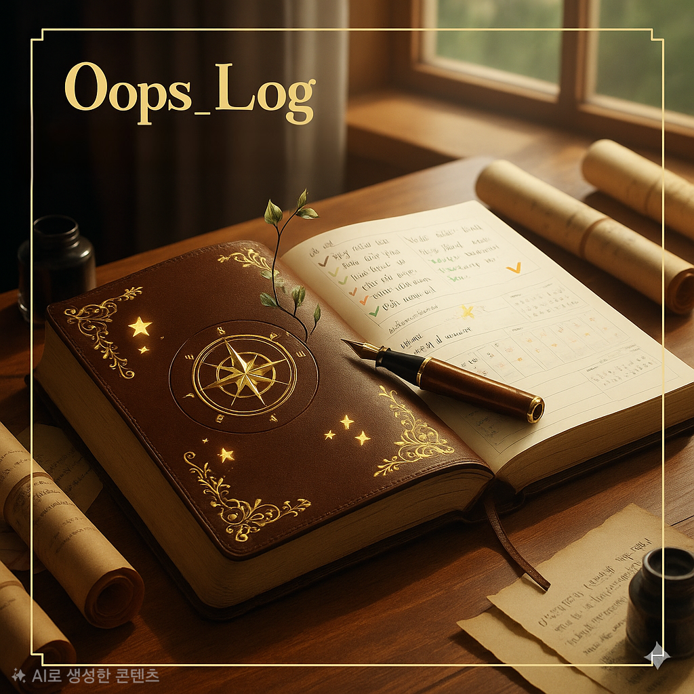
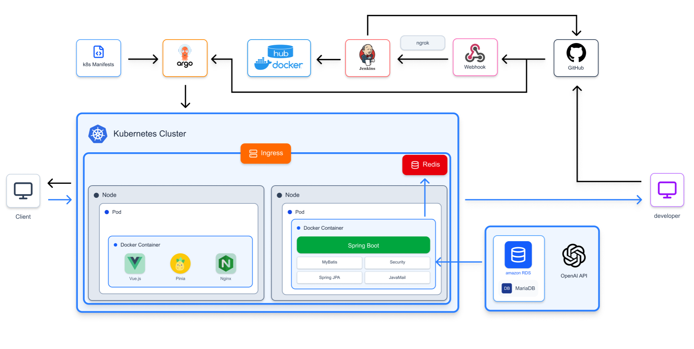

# \# Oops\_Log - 실수와 성취를 기록하는 성장 다이어리

# 

# 

# 

# <br>

# 

# ---

# 

# \## <span id="1"> 🖼️ DevOops 팀원 소개</span>

# 

# <div align="center">

# 

# |   |   |   |   |   |

# | :--------------------------------------------------------------: | :--------------------------------------------------------------: | :--------------------------------------------------------------------------: | :-----------------------------------------------------------: | :--------------------------------------------------------------: |

# |            |            |                        |         |            |

# |      \[강지현](https://github.com/Kjandgo)      |      \[정건일](https://github.com/kyuhon)      |      \[이순우](https://github.com/SoonWooLee1)      |      \[송형석](https://github.com/thdgudtjr0415)      |      \[윤서진](https://github.com/ysj0826)      |

# 

# </div>

# 

# &nbsp;

# <br>

# 

# -----

# 

# \## 🗂️ \*\*프로젝트 기획서: Oops\_Log\*\*

# 

# <br>

# 

# \### \*\*1-1. 개요 (Overview)\*\*

# 

# > ### \*\*"실수와 성취를 기록하며 자기수용과 회복력을 키우는 조용한 서재"\*\*

# >

# >   완벽하지 않아도 괜찮습니다.

# >

# >   완성되지 않아도 괜찮습니다.

# >

# 

# <br>

# Oops\_Log는 \*\*실수(Oops)와 성취(Ooh)를 함께 기록하며 성장하는 공간\*\*입니다.

# 

# 흔들렸다면 살아있다는 증거이고, 빛났다면 성장했다는 증표입니다.

# 

# 당신의 하루는 기록될 가치가 있습니다.

# 

# <br>

# 

# -----

# 

# \### \*\*1-2. 프로젝트 배경 (Background)\*\*

# 

# \#### \*\*🤔 기존의 문제점\*\*

# 

# 우리는 완벽을 강요받는 시대에 살고 있습니다. SNS에는 성공과 행복만이 가득하고, 실수와 좌절은 숨겨야 할 것처럼 여겨집니다.

# 

# <br>

# 

# \#### \*\*💡 새로운 기록 공간의 필요성\*\*

# 

# 하지만 진짜 성장은 실수를 인정하고, 작은 성취를 축하하고, 흔들리는 나 자신을 받아들일 때 시작됩니다.

# 

# Oops\_Log는 당신이 완벽하지 않아도 괜찮다고 말합니다. 오늘 넘어졌다면, 다시 일어났다는 것이 더 중요합니다.

# 

# 이곳은 당신을 위한 조용한 서재입니다. 천천히, 솔직하게, 당신만의 이야기를 기록해보세요.

# 

# <br>

# 

# > #### \*\*✨ 기대 효과 및 핵심 목표 ✨\*\*

# >

# > -----

# >

# >   - \*\*✅ 실수의 자산화:\*\* 실수를 감추지 않고 기록함으로써 성장의 패치노트로 만듭니다.

# >

# >   - \*\*🤝 성취의 축하:\*\* 작은 성취(Ooh)도 기록하며 스스로를 인정하고 동기를 부여합니다.

# >

# >   - \*\*📈 성장 과정 추적:\*\* 감정 강도와 태그를 통해 나의 감정 패턴을 파악합니다.

# >

# >   - \*\*🔒 안전한 공간:\*\* 비공개/익명 공개 옵션을 통해 솔직한 이야기를 안전하게 기록합니다.

# >

# 

# ---

# 

# \# \*\*✨ Oops\_Log: 주요 기능 ✨\*\*

# 

# 각 기능이 어떻게 실제 데이터와 연결되는지 함께 확인해 보세요.

# 

# \### 😭 Oops - 실수의 기록

# \- \*\*불안, 후회, 피로\*\*의 순간을 기록합니다.

# \- 실수는 버그가 아니라 성장의 패치노트라는 관점으로 스스로를 용서하고 다시 일어서는 연습을 합니다.

# \- AI가 사용자의 글을 분석하여 감정을 공감하고 따뜻한 피드백을 제공합니다.

# &nbsp; > 💾 \*\*관련 기능:\*\* OopsCommandController, OopsQueryController, AiController

# 

# ---

# 

# \### 🥰 Ooh - 성취의 기록

# \- \*\*감사, 만족, 희망\*\*의 순간을 기록합니다.

# \- 작은 성취도 큰 의미가 있음을 되새기며 오늘의 빛나는 순간을 놓치지 않습니다.

# \- 다른 사용자의 Ooh 기록에 '좋아요'를 누르고 댓글로 응원할 수 있습니다.

# &nbsp; > 💾 \*\*관련 기능:\*\* OohCommandController, OohQueryController, LikesCommandController, CommentsCommandController

# 

# ---

# 

# \### 🏷️ 감정 강도와 태그

# \- 오늘의 감정 강도와 유형을 표시하고 태그를 남깁니다.

# \- 시간이 지나며 나의 감정 패턴을 파악할 수 있습니다.

# &nbsp; > 💾 \*\*관련 기능:\*\* TagCommandController, TagQueryController, AdminReadController

# 

# ---

# 

# \### 🔒 안전한 기록 공간

# \- 모든 기록은 비공개(기본) 또는 익명 공개를 선택할 수 있습니다.

# \- 다른 사람과 공유 시에는 익명으로 표시되어 안전하게 소통할 수 있습니다.

# &nbsp; > 💾 \*\*관련 기능:\*\* OohCommandEntity (isPrivate), OopsCommandEntity (oopsIsPrivate)

# 

# ---

# 

# \### 🛡️ 커뮤니티 안전장치

# \- 불쾌한 게시글이나 댓글은 신고 기능을 통해 관리자에게 알릴 수 있습니다.

# \- 관리자는 신고 내역을 상세 조회하고 '승인' 또는 '반려' 처리를 할 수 있습니다.

# \- 신고 승인 시 해당 게시물이나 댓글은 숨김(소프트 삭제) 처리됩니다.

# &nbsp; > 💾 \*\*관련 기능:\*\* ReportController, ReportReadController, ReportSerivceImpl

# 

# ---

# 

# \### 📈 성장 그래프 및 활동

# \- 마이페이지에서 내가 기록한 Oops/Ooh 기록을 잔디 그래프로 확인할 수 있습니다.

# \- 팔로우/팔로워 기능을 통해 다른 사용자와 소통하고, 북마크 기능으로 의미 있는 기록을 저장할 수 있습니다.

# &nbsp; > 💾 \*\*관련 기능:\*\* RecordHistoryQueryController, FollowQueryController, BookmarkQueryController

# 

# <br>

# 

# ---

# 

# \## 2. 기능 명세서

# 

# \## 2-1. WBS

# 

#  </img><br>

# 

# \## 2-2. 요구사항 명세서 

# 

#  </img>

#  </img> <br>

# 

# ---

# 

# \## 3. DDD 설계

# 

# <details>

# &nbsp;   <summary>이벤트 도메인</summary>

#  </img>

# </details>

# 

# <details>

# &nbsp;   <summary>Policy-Context</summary>

#  </img>

# </details>

# 

# <details>

# &nbsp;   <summary>Context-Mapping</summary>

#  </img>

# </details>

# 

# <br>

# 

# ---

# 

# \## 4. DB 설계

# 

# <details>

# &nbsp;   <summary>논리 모델링</summary>

#  </img>

# </details>

# 

# <details>

# &nbsp;   <summary>물리 모델링</summary>

#  </img>

# </details>

# 

# <br>

# 

# ---

# 

# \## 5. Figma

# 

# <details>

# &nbsp;   <summary>Figma 디자인</summary>

#  </img>

# </details>

# 

# <br>

# 

# ---

# 

# \## 6. CI/CD 프로젝트 아키텍쳐

# 

# <details>

# &nbsp;   <summary>CI/CD</summary>

#  </img>

# </details>

# 

# <br>

# 

# ---

# 

# \## 7. CI/CD 테스트

# 

# <details>

# &nbsp;   <summary>CI/CD 테스트</summary>

#  </img>

# </details>

# 

# <br>

# 

# ---

# 

# \## 8. 젠킨스 파이프라인 파일 스크립트 코드

# 

# ```groovy

# pipeline {

# &nbsp;   agent any

# 

# &nbsp;   tools {

# &nbsp;       gradle 'gradle'

# &nbsp;       jdk 'openJDK17'

# &nbsp;   }

# 

# &nbsp;   environment {

# &nbsp;       SOURCE\_GITHUB\_URL = 'https://github.com/DevOops-be19/Oops\_log-backend.git'

# &nbsp;       MANIFESTS\_GITHUB\_URL = 'https://github.com/DevOops-be19/oops\_log\_manifest.git'

# &nbsp;       GIT\_USERNAME = 'kjandgo'

# &nbsp;       GIT\_EMAIL = 'rptmffld0204@gmail.com'

# &nbsp;   }

# 

# &nbsp;   stages {

# &nbsp;       stage('Preparation') {

# &nbsp;           steps {

# &nbsp;               script {

# &nbsp;                   if (isUnix()) {

# &nbsp;                       sh 'docker --version'

# &nbsp;                   } else {

# &nbsp;                       bat 'docker --version'

# &nbsp;                   }

# &nbsp;               }

# &nbsp;           }

# &nbsp;       }

# &nbsp;       stage('Source Build') {

# &nbsp;           steps {

# &nbsp;               git branch: 'main', url: "${env.SOURCE\_GITHUB\_URL}"

# &nbsp;               script {

# &nbsp;                   withCredentials(\[file(credentialsId: 'oops\_yml', variable: 'secretFile')]){

# &nbsp;                       if (isUnix()) {

# &nbsp;                           sh 'cp $secretFile ./src/main/resources/application.yml'

# &nbsp;                           sh "chmod +x ./gradlew"

# &nbsp;                           sh "./gradlew clean build -x test"

# &nbsp;                       } else {

# &nbsp;                           bat "copy %secretFile% .\\\\src\\\\main\\\\resources\\\\application.yml"

# &nbsp;                           bat "gradlew.bat clean build -x test"

# &nbsp;                       }

# &nbsp;                   }

# &nbsp;               }

# &nbsp;           }

# &nbsp;       }

# &nbsp;       stage('Container Build and Push') {

# &nbsp;           steps {

# &nbsp;               script {

# &nbsp;                   withCredentials(\[usernamePassword(credentialsId: 'DOCKERHUB\_PASSWORD', usernameVariable: 'DOCKER\_USER', passwordVariable: 'DOCKER\_PASS')]) {

# &nbsp;                       if (isUnix()) {

# &nbsp;                           sh "docker build -t ${DOCKER\_USER}/oops\_log\_back:${currentBuild.number} ."

# &nbsp;                           sh "docker build -t ${DOCKER\_USER}/oops\_log\_back:latest ."

# &nbsp;                           sh "docker login -u ${DOCKER\_USER} -p ${DOCKER\_PASS}"

# &nbsp;                           sh "docker push ${DOCKER\_USER}/oops\_log\_back:${currentBuild.number}"

# &nbsp;                           sh "docker push ${DOCKER\_USER}/oops\_log\_back:latest"

# &nbsp;                       } else {

# &nbsp;                           bat "docker build -t ${DOCKER\_USER}/oops\_log\_back:${currentBuild.number} ."

# &nbsp;                           bat "docker build -t ${DOCKER\_USER}/oops\_log\_back:latest ."

# &nbsp;                           bat "docker login -u %DOCKER\_USER% -p %DOCKER\_PASS%"

# &nbsp;                           bat "docker push ${DOCKER\_USER}/oops\_log\_back:${currentBuild.number}"

# &nbsp;                           bat "docker push ${DOCKER\_USER}/oops\_log\_back:latest"

# &nbsp;                       }

# &nbsp;                   }

# &nbsp;               }

# &nbsp;           }

# &nbsp;       }

# &nbsp;       stage('K8S Manifest Update') {

# &nbsp;           steps {

# &nbsp;               // k8s-manifests 리포지토리를 main 브랜치에서 클론한다. 이때 자격 증명 github가 사용된다.

# &nbsp;               git credentialsId: 'github',

# &nbsp;                   url: "${env.MANIFESTS\_GITHUB\_URL}",

# &nbsp;                   branch: 'main'

# &nbsp;               

# &nbsp;               script { 

# &nbsp;                   withCredentials(\[usernamePassword(credentialsId: 'github', usernameVariable: 'GIT\_USER', passwordVariable: 'GIT\_PASS')]) {

# &nbsp;                       def githubUrl = env.MANIFESTS\_GITHUB\_URL.replace('https://', '')

# &nbsp;                       if (isUnix()) {

# &nbsp;                           // Unix 시스템에서 boot-deployment.yml 파일 수정 후 commit 후 push

# &nbsp;                           sh "sed -i '' 's/argo\_boot:.\*\\$/oops\_log\_back:${currentBuild.number}/g' kubernetes\_manifest/oops-backend-deploy.yml"

# &nbsp;                           sh "git add kubernetes\_manifest/oops-backend-deploy.yml"

# &nbsp;                           sh "git config --global user.name '${env.GIT\_USERNAME}'"

# &nbsp;                           sh "git config --global user.email '${env.GIT\_EMAIL}'"

# &nbsp;                           sh "git commit -m '\[UPDATE] ${currentBuild.number} image versioning'"

# &nbsp;                           // 인증 정보 포함하여 push

# &nbsp;                           sh "git push https://${GIT\_USER}:${GIT\_PASS}@${githubUrl} main"

# &nbsp;                       } else {

# &nbsp;                           // Windows 시스템에서 boot-deployment.yml 파일 수정 후 commit 후 push

# &nbsp;                           bat "powershell -Command \\"(Get-Content kubernetes\_manifest/oops-backend-deploy.yml) -replace 'oops\_log\_back:.\*', 'oops\_log\_back:${currentBuild.number}' | Set-Content kubernetes\_manifest/oops-backend-deploy.yml\\""

# &nbsp;                           bat "git add kubernetes\_manifest/oops-backend-deploy.yml"

# &nbsp;                           bat "git config --global user.name '${env.GIT\_USERNAME}'"

# &nbsp;                           bat "git config --global user.email '${env.GIT\_EMAIL}'"

# &nbsp;                           bat "git commit -m \\"\[UPDATE] ${currentBuild.number} image versioning\\""

# &nbsp;                           // Windows에서 변수 참조 방식 사용

# &nbsp;                           bat "git push https://%GIT\_USER%:%GIT\_PASS%@${githubUrl} main"

# &nbsp;                       }

# &nbsp;                   }

# &nbsp;               }

# &nbsp;           }

# &nbsp;       }

# &nbsp;   }

# 

# &nbsp;   post {

# &nbsp;       always {

# &nbsp;           script {

# &nbsp;               if (isUnix()) {

# &nbsp;                   sh 'docker logout'

# &nbsp;               } else {

# &nbsp;                   bat 'docker logout'

# &nbsp;               }

# &nbsp;           }

# &nbsp;       }

# &nbsp;       success {

# &nbsp;           echo 'Pipeline succeeded!'

# &nbsp;       }

# &nbsp;       failure {

# &nbsp;           echo 'Pipeline failed!'

# &nbsp;       }

# &nbsp;   }

# }

# ```

# ---

# 

# 

# 

# <br>

# 

# \## 9. 테스트 결과 보고서

# 

# \## 👤 회원 관리 테스트

# 

# &nbsp; <details>

# &nbsp;   <summary>회원</summary>

# &nbsp;   <br>

# &nbsp;   <details>

# &nbsp;     <summary>회원 가입</summary>

# &nbsp;     

# &nbsp;   </details>

# &nbsp;   <details>

# &nbsp;     <summary>로그인</summary>

# &nbsp;     

# &nbsp;   </details>

# &nbsp;   <details>

# &nbsp;     <summary>아이디 찾기</summary>

# &nbsp;     

# &nbsp;   </details>

# &nbsp;   <details>

# &nbsp;     <summary>비밀번호 찾기</summary>

# &nbsp;     

# &nbsp;   </details>

# &nbsp;   <details>

# &nbsp;     <summary>마이페이지 수정</summary>

# &nbsp;     

# &nbsp;   </details>

# &nbsp; </details>

# 

# </details>

# 

# <br>

# 

# \## 🧑‍💼 인플루언서 페이지 테스트

# 

# <details>

# <summary>인플루언서 페이지 검색</summary>

# &nbsp; 

# </details>

# 

# <details>

# <summary>팔로우, 언팔로우</summary>

# &nbsp; 

# </details>

# 

# <details>

# <summary>개인 게시물 조회</summary>

# &nbsp; 

# </details>

# 

# <details>

# <summary>개별 조회</summary>

# &nbsp; 

# </details>

# 

# <details>

# <summary>페이지네이션</summary>

# &nbsp; 

# </details>

# 

# <details>

# <summary>팔로우, 언팔로우</summary>

# &nbsp; 

# </details>

# 

# <br>

# 

# \## 게시물 테스트

# 

# <details>

# <summary>패션 아이템 추가</summary>

#   

# </details>

# <details>

# <summary>게시글 작성 성공</summary>

#   

# </details>

# <details>

# <summary>게시글 삭제</summary>

#   

# </details>

# <details>

# <summary>게시글 이미지 추가</summary>

#   

# </details>

# <details>

# <summary>게시글 좋아요/힘내요 추가</summary>

#   

# </details>

# <details>

# <summary>게시글 내용 추가</summary>

#   

# </details>

# <details>

# <summary>게시글 온도 수정</summary>

#   

# </details>

# <details>

# <summary>해시태그 추가</summary>

#   

# </details>

# <details>

# <summary>멘토링 게시물</summary>

#   

# </details>

# <details>

# <summary>후기 게시물 시연</summary>

#   

# </details>

# 

# \## 🚩 신고 관리

# <details>

# <summary>신고 추가</summary>

#   

# </details>

# <details>

# <summary>신고 상태 변경</summary>

#   

# </details>

# <details>

# <summary>신고 삭제</summary>

#   

# </details>

# 

# \## ✉️ 쪽지 관리

# <details>

# <summary>일반 쪽지 송신</summary>

#   

# </details>

# <details>

# <summary>일반 쪽지 조회</summary>

#   

# </details>

# <details>

# <summary>멘토링 쪽지 송신</summary>

#   

# </details>

# <details>

# <summary>멘토링 쪽지 조회</summary>

#   

# </details>

# 

# ---

# 

# \## 10. 기술 스택

# <div align=left><h3>BACKEND</h3></div>

# 

# <div align=left> 

# &nbsp;  

# &nbsp;  

# &nbsp; 

# &nbsp; 

# 

# &nbsp; !\[JWT](https://img.shields.io/badge/JWT-black?style=for-the-badge\&logo=JSON%20web%20tokens)

# 

# &nbsp; 

# &nbsp; 

# &nbsp; 

# &nbsp; 

# 

# &nbsp; <br>

# 

# </div>

# 

# \### BACKEND

# !\[Spring](https://img.shields.io/badge/Spring-6DB33F?style=for-the-badge\&logo=spring\&logoColor=white)

# !\[Spring Boot](https://img.shields.io/badge/Spring\_Boot-6DB33F?style=for-the-badge\&logo=springboot\&logoColor=white)

# !\[Spring Security](https://img.shields.io/badge/Spring\_Security-6DB33F?style=for-the-badge\&logo=springsecurity\&logoColor=white)

# !\[Spring Data JPA](https://img.shields.io/badge/Spring\_Data\_JPA-6DB33F?style=for-the-badge)

# !\[Gradle](https://img.shields.io/badge/Gradle-02303A?style=for-the-badge\&logo=gradle\&logoColor=white)

# !\[JWT](https://img.shields.io/badge/JWT-000000?style=for-the-badge\&logo=JSON%20web%20tokens\&logoColor=white)

# !\[Hibernate](https://img.shields.io/badge/Hibernate-59666C?style=for-the-badge\&logo=hibernate\&logoColor=white)

# !\[Docker](https://img.shields.io/badge/Docker-2496ED?style=for-the-badge\&logo=docker\&logoColor=white)

# 

# \### FRONTEND

# !\[HTML5](https://img.shields.io/badge/HTML5-E34F26?style=for-the-badge\&logo=html5\&logoColor=white)

# !\[CSS3](https://img.shields.io/badge/CSS3-1572B6?style=for-the-badge\&logo=css3\&logoColor=white)

# !\[JavaScript](https://img.shields.io/badge/JavaScript-F7DF1E?style=for-the-badge\&logo=javascript\&logoColor=black)

# !\[Vue.js](https://img.shields.io/badge/Vue.js-4FC08D?style=for-the-badge\&logo=vue.js\&logoColor=white)

# !\[Vue Router](https://img.shields.io/badge/Vue\_Router-4FC08D?style=for-the-badge)

# !\[Axios](https://img.shields.io/badge/Axios-5A29E4?style=for-the-badge\&logo=axios\&logoColor=white)

# 

# \### DB

# !\[MariaDB](https://img.shields.io/badge/MariaDB-003545?style=for-the-badge\&logo=mariadb\&logoColor=white)

# !\[MyBatis](https://img.shields.io/badge/MyBatis-FFB725?style=for-the-badge\&logo=MyBatis\&logoColor=black)

# 

# \### DEVOPS

#  

# 

# 

# 

# 

# \### TOOL

# !\[Git](https://img.shields.io/badge/Git-F05032?style=for-the-badge\&logo=git\&logoColor=white)

# !\[GitHub](https://img.shields.io/badge/GitHub-181717?style=for-the-badge\&logo=github\&logoColor=white)

# !\[VS Code](https://img.shields.io/badge/VS%20Code-007ACC?style=for-the-badge\&logo=visualstudiocode\&logoColor=white)

# !\[IntelliJ IDEA](https://img.shields.io/badge/IntelliJIDEA-000000?style=for-the-badge\&logo=intellijidea\&logoColor=white)

# !\[Notion](https://img.shields.io/badge/Notion-000000?style=for-the-badge\&logo=notion\&logoColor=white)

# !\[Figma](https://img.shields.io/badge/Figma-F24E1E?style=for-the-badge\&logo=figma\&logoColor=white)

# !\[Discord](https://img.shields.io/badge/Discord-5865F2?style=for-the-badge\&logo=discord\&logoColor=white)

# !\[Postman](https://img.shields.io/badge/Postman-FF6C37?style=for-the-badge\&logo=postman\&logoColor=white)

# &nbsp; 

# &nbsp; <br>

# </div>

# 

# <br>

# 

# ---

# 

# \## 11. 개인 회고록

# 

# \### 강지현

# 

# \*\*이번 프로젝트에서 맡은 역할\*\*

# \- 11

# 

# \*\*잘한 점\*\*

# \- 11

# 

# \*\*아쉬운 점\*\*

# \- 11

# 

# \*\*배운 점\*\*

# \- 11

# 

# \*\*다음 프로젝트에 적용하고 싶은 것\*\*

# \- 11

# 

# \### 정건일

# 

# \*\*이번 프로젝트에서 맡은 역할\*\*

# \- 11

# 

# \*\*잘한 점\*\*

# \- 11

# 

# \*\*아쉬운 점\*\*

# \- 11

# 

# \*\*배운 점\*\*

# \- 11

# 

# \*\*다음 프로젝트에 적용하고 싶은 것\*\*

# \- 11

# 

# \### 송형석

# 

# \*\*이번 프로젝트에서 맡은 역할\*\*

# \- 11

# 

# \*\*잘한 점\*\*

# \- 11

# 

# \*\*아쉬운 점\*\*

# \- 11

# 

# \*\*배운 점\*\*

# \- 11

# 

# \*\*다음 프로젝트에 적용하고 싶은 것\*\*

# \- 11

# 

# \### 이순우

# 

# \*\*이번 프로젝트에서 맡은 역할\*\*

# \- 11

# 

# \*\*잘한 점\*\*

# \- 11

# 

# \*\*아쉬운 점\*\*

# \- 11

# 

# \*\*배운 점\*\*

# \- 11

# 

# \*\*다음 프로젝트에 적용하고 싶은 것\*\*

# \- 11

# 

# \### 윤서진

# 

# \*\*이번 프로젝트에서 맡은 역할\*\*

# \- 11

# 

# \*\*잘한 점\*\*

# \- 11

# 

# \*\*아쉬운 점\*\*

# \- 11

# 

# \*\*배운 점\*\*

# \- 11

# 

# \*\*다음 프로젝트에 적용하고 싶은 것\*\*

# \- 11

# 


